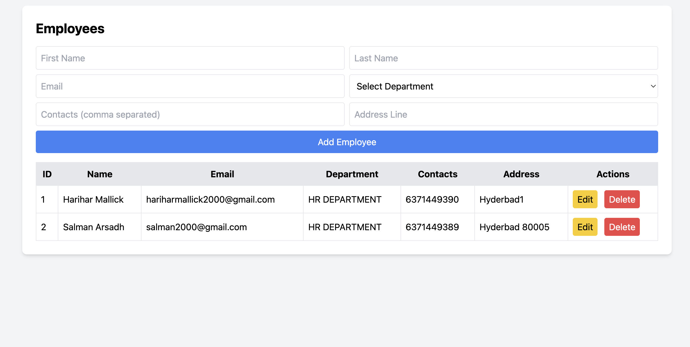
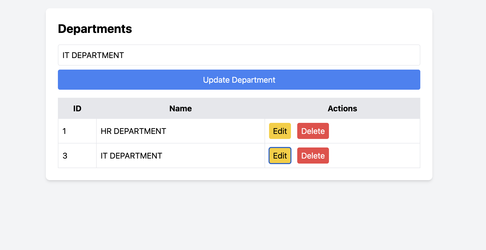

# StaffSphere

A simple web application for managing employees and departments, built with Laravel and TailwindCSS.

---

## Description

**StaffDesk** provides an intuitive interface to manage employees and departments within an organization. The application allows users to add, edit, and delete employee and department records, with real-time updates and dynamic dropdowns. Designed for ease of use and extensibility, StaffDesk is ideal for small to medium-sized teams needing a lightweight HR management solution.

---

Employee and Department Management UI Documentation

---

## Screenshots

### Employee Management UI



### Department Management UI



---

### 1. Employee Management UI

**File:** employee.html

**URL:** [http://127.0.0.1:8000/employees-ui](http://127.0.0.1:8000/employees-ui)

**Features:**

* Add new employees
* Edit existing employees
* Delete employees
* Populate department dropdown dynamically from API
* Handle multiple contacts (comma-separated)
* Handle single address input (can be extended for multiple addresses)

**Endpoints Used:**

* `GET /api/departments` -> Populate dropdown
* `GET /api/employees` -> Fetch all employees
* `GET /api/employees/{id}` -> Fetch single employee for edit
* `POST /api/employees` -> Add new employee
* `PUT /api/employees/{id}` -> Update employee
* `DELETE /api/employees/{id}` -> Delete employee

**HTML Elements:**

* Form Fields: first_name, last_name, email, department (dropdown), contacts, address
* Hidden Field: employeeId (for editing)
* Table: Displays list of employees
* Buttons: Edit and Delete for each employee

**JavaScript Functions:**

1. `loadDepartments()` - Fetch departments and populate dropdown
2. `fetchEmployees()` - Fetch all employees and display in table
3. `editEmployee(id)` - Populate form fields with employee data for editing
4. `deleteEmployee(id)` - Delete employee
5. Form submit event - Add or update employee based on `employeeId` field

**Behavior:**

* Clicking Edit populates the form with employee data.
* Submit button acts as 'Add' or 'Update' based on hidden `employeeId`.
* Contacts are split by comma to create multiple contact entries.

---

### 2. Department Management UI

**File:** department.html

**URL:** [http://127.0.0.1:8000/departments-ui](http://127.0.0.1:8000/departments-ui)

**Features:**

* Add new departments
* Edit existing departments
* Delete departments
* Single input field for department name

**Endpoints Used:**

* `GET /api/departments` -> Fetch all departments
* `GET /api/departments/{id}` -> Fetch single department for edit
* `POST /api/departments` -> Add new department
* `PUT /api/departments/{id}` -> Update department
* `DELETE /api/departments/{id}` -> Delete department

**HTML Elements:**

* Form Field: department name
* Hidden Field: departmentId (for editing)
* Table: Displays list of departments
* Buttons: Edit and Delete for each department

**JavaScript Functions:**

1. `fetchDepartments()` - Fetch all departments and display in table
2. `editDepartment(id)` - Populate form field with department name for editing
3. `deleteDepartment(id)` - Delete department
4. Form submit event - Add or update department based on `departmentId` field

**Behavior:**

* Clicking Edit populates the form with department name.
* Submit button acts as 'Add' or 'Update' based on hidden `departmentId`.

---
## Setup Guide

### Prerequisites

- PHP >= 8.0
- Composer
- Node.js & npm (for frontend assets)
- MySQL or compatible database

### Steps

1. **Clone the repository**
   ```sh
   git clone repo url
   cd project
   ```

2. **Install PHP dependencies**
   ```sh
   composer install
   ```

3. **Run migrations**
   ```sh
   php artisan migrate
   ```

4. **Start the development server**
   ```sh
   php artisan serve
   ```
   - The app will be available at [http://127.0.0.1:8000](http://127.0.0.1:8000)

5. **Access the UIs**
    - Employees UI: [http://127.0.0.1:8000/employees-ui](http://127.0.0.1:8000/employees-ui)
    - Departments UI: [http://127.0.0.1:8000/departments-ui](http://127.0.0.1:8000/departments-ui)

---

### 3. Notes

* Both UIs use TailwindCSS for styling.
* Employee dropdown dynamically fetches departments.
* Both Add/Edit operations are handled in the same form.
* Tables display real-time data after any operation.
* Can be extended for multiple addresses or contacts dynamically.
* PHP Version: 8.4.12
* Laravel Version: 8.83.29

---

**Author:** Harihar Mallick
**Date:** 2025-09-25
